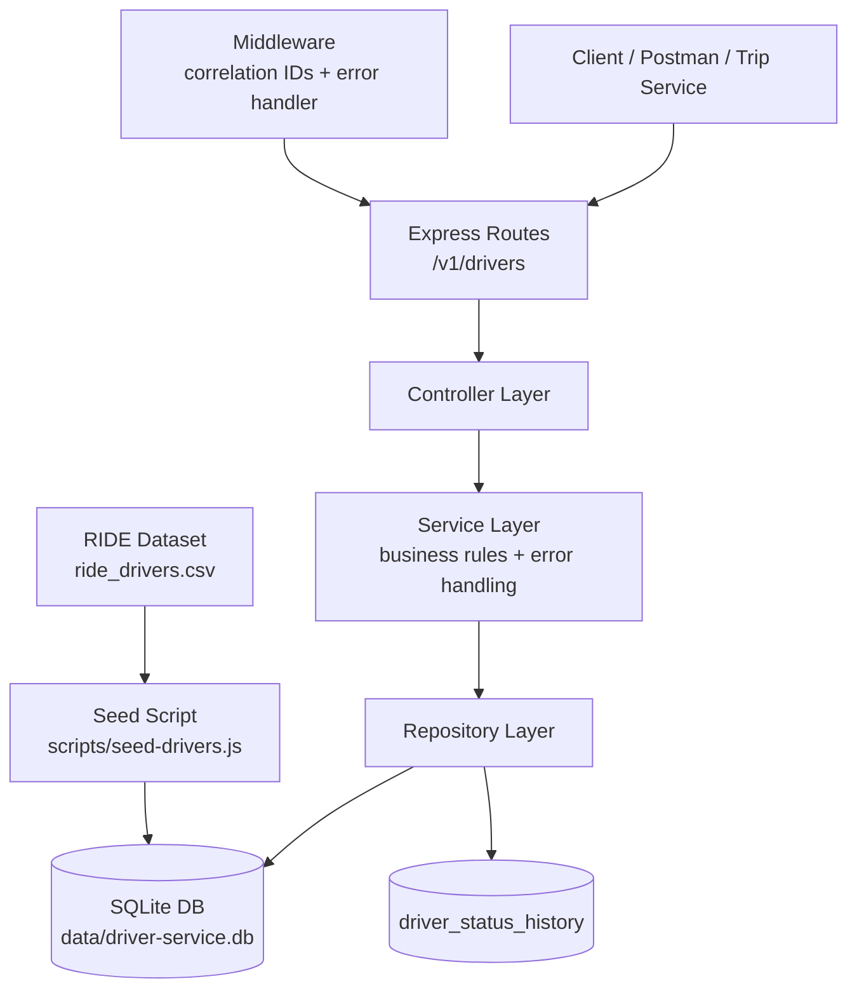

# Driver Service

Driver onboarding and availability microservice for the BITS ride-hailing assignment.

## Features

- Driver registration with vehicle details
- Driver lookup by ID
- Driver availability updates using `is_active`
- Historical status tracking
- Active-driver filtering for Trip Service integration
- Structured JSON logs with correlation IDs
- SQLite database dedicated to this service
- CSV seed support using the provided `ride_drivers.csv` dataset

## Architecture



The service follows a simple layered architecture:

- Routes expose the REST APIs.
- Controllers validate requests and shape responses.
- Services apply business logic and handle domain-level checks.
- Repositories talk to SQLite and store driver/status history data.
- The seed script loads the shared driver dataset into the service database.

## API

### Health

`GET /health`

### Create driver

`POST /v1/drivers`

Sample request:

```json
{
  "id": 101,
  "name": "Amar Rao",
  "phone": "9876543210",
  "email": "amar.rao@example.com",
  "vehicle_type": "SUV",
  "vehicle_model": "Hyundai Creta",
  "vehicle_plate": "KA01AB1234",
  "city": "Bengaluru",
  "created_at": "2025-07-30T05:58:56.000Z",
  "is_active": true
}
```

### Get driver

`GET /v1/drivers/:id`

### Update driver

`PUT /v1/drivers/:id`

Sample request:

```json
{
  "name": "Amar Rao",
  "phone": "9876543210",
  "email": "amar.rao@example.com",
  "vehicle_type": "Sedan",
  "vehicle_model": "Honda City",
  "vehicle_plate": "KA01AB1234",
  "city": "Bengaluru",
  "is_active": true
}
```

### List drivers

`GET /v1/drivers?is_active=true&city=Bengaluru&vehicle_type=SUV&limit=10`

This query is intended for Trip Service integration so only active drivers are considered for assignment.

### Update availability

`PATCH /v1/drivers/:id/status`

Sample request:

```json
{
  "is_active": false,
  "reason": "driver_signed_off"
}
```

## Local setup

```bash
PATH="/opt/homebrew/bin:$PATH" npm install
PATH="/opt/homebrew/bin:$PATH" npm start
```

## Seed with dataset

```bash
PATH="/opt/homebrew/bin:$PATH" npm run seed:drivers
```

By default the seed script looks for:

`RIDE Dataset/ride_drivers.csv`

inside the repository, so it works for every teammate without hardcoded personal paths.

If you want to pass a custom file explicitly:

```bash
PATH="/opt/homebrew/bin:$PATH" npm run seed:drivers -- "./RIDE Dataset/ride_drivers.csv"
```

If someone accidentally points the Driver Service at `ride_riders.csv`, the script now fails with a clear error because that CSV belongs to Rider Service, not Driver Service.

The seed script preserves the dataset `driver_id` values so they stay compatible with downstream trip data.

## Docker

```bash
docker build -t driver-service .
docker run -p 3003:3003 driver-service
```

## Docker Compose

```bash
docker compose up --build
```

The compose setup mounts `./data` into the container so the seeded `driver-service.db` stays available across restarts.

Useful checks:

```bash
docker compose ps
curl http://127.0.0.1:3003/health
curl http://127.0.0.1:3003/v1/drivers/2
```

## API Contract

The OpenAPI contract for this service is available at:

`docs/driver-service-api-contract.yaml`
